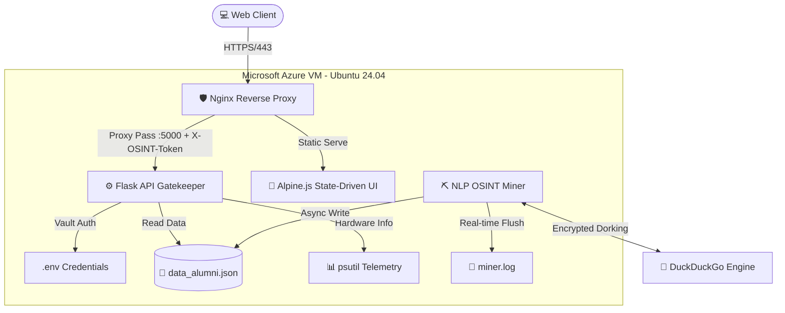

# 0sintCX

# 👁️‍🗨️ 0sint_CX Analytics: Advanced OSINT & Telemetry Dashboard

-blue.svg?style=for-the-badge)


**Cxz_CORE Analytics** adalah sebuah *Full-Stack Open Source Intelligence (OSINT) Engine* skala industri yang dirancang untuk melakukan ekstraksi, pemetaan karir, dan analisis jejak digital secara otomatis dengan standar keamanan korporat. 

Sistem ini mengadopsi arsitektur **Decoupled**, memisahkan proses *data mining* yang berat di latar belakang dengan antarmuka *dashboard* analitik yang ringan, *real-time*, dan dilindungi oleh *Middleware Security Layer* tanpa membebani *database*.

---

## 🏗️ System Architecture & Infrastructure

Sistem ini di-*deploy* pada komputasi awan dengan lapisan keamanan ganda. Menggunakan **Nginx** murni sebagai *Reverse Proxy* dan *SSL Terminator*, sementara logika otentikasi diserahkan sepenuhnya kepada *API Gateway* berbasis Token.



### 📋 Spesifikasi Infrastruktur Terapan

-   **Cloud Instance:** Microsoft Azure VM (Standard B2als v2 - 2 vCPUs, 4 GiB RAM) - _Optimized for High I/O._
    
-   **Web Server:** Nginx (Static File Server & API Reverse Proxy).
    
-   **Security Layer:** - Sertifikat Let's Encrypt SSL/TLS dengan aturan _Strict HTTPS Redirect_ & mitigasi _MitM (Man-In-The-Middle)_.
    
    -   **Tokenized Auth:** Otentikasi kustom via file `.env` (Zero-Database Overhead).
        
    -   **VVIP Headers:** Menggunakan kustom header `X-OSINT-Token` dengan proteksi _CORS Preflight Bypass_ (Metode `OPTIONS`).
        
    -   **UFW (Uncomplicated Firewall):** Terkonfigurasi ketat pada port `80`, `443`, dan `22`.
        
-   **Backend Engine:** Python 3 (Flask, `psutil`, `functools.wraps`).
    
-   **OSINT Engine:** Python 3 (`duckduckgo-search`, Semantic Scanner v2.0).
    
-   **Frontend UI:** HTML5, Tailwind CSS, Alpine.js (Reactive State Management, Mobile-First Design).


## ⚙️ Core Pipeline & Workflow

Sistem membagi beban kerja ke dalam dua _pipeline_ yang berjalan paralel menggunakan `tmux`.

### A. The OSINT Miner Pipeline (`miner.py`)

Berjalan secara abadi di latar belakang (_Daemonized_). Menerapkan **Semantic Enrichment Pipeline** untuk pemenuhan _Coverage Rubric_:

1.  **Stage 1 (The 8-Point Rubric Extractor):** Algoritma **Regex NLP (Natural Language Processing)** tingkat lanjut membedah teks profil target untuk mengekstrak **Email** (`[\w\.-]+@[\w\.-]+`) dan **Nomor HP**.
    
2.  **Stage 2 (Semantic Corporate Profiler):** Mendeteksi _Prefix_ Instansi (PT, CV, Apotek, Dinas, Bank) untuk mengisolasi nama tempat kerja. Kemudian melakukan perburuan otonom untuk menemukan **Alamat Kantor** dan **Akun Instagram Resmi Perusahaan**.
    
3.  **Data Integrity & I/O:** Menyimpan kompilasi akhir ke dalam repositori lokal `data_alumni.json`.
    

> **🧠 Deep Dive: Log Auto-Rotation & Memory Flush** > Miner menggunakan `RotatingFileHandler` (Max 500KB) dengan siklus `flush()` manual. Ini mencegah _Storage Bloat_ yang bisa membuat server _crash_, sekaligus menembus isolasi _Python File Buffering_ sehingga UI bisa membaca log secara _real-time_.


### B. The Analytics & Gatekeeper Pipeline (`app.py` & `index.html`)

Menerapkan **State-Driven UI** untuk memanipulasi DOM dan menyajikan keamanan kelas _enterprise_ tanpa perpindahan halaman statis.

1.  **State-Driven Login Overlay:** UI memeriksa keberadaan Token otentikasi di memori _browser_. Jika kosong, _dashboard_ OSINT dikunci dan diganti dengan _Layer Form Login Cyberpunk_.
    
2.  **Ghost Protocol (Timestamp Tracker):** Sistem memantau interaksi pengguna melalui pencatatan waktu di `localStorage`. Kebal terhadap fitur _Sleep Mode_ pada browser. Jika terdeteksi AFK selama 10 menit, skrip akan memicu _Auto-Logout_ dan menghancurkan Token.
    
3.  **Smart Data Segregation (Quick Tabs):** Fitur filter responsif untuk mengisolasi target potensial. Memisahkan data mentah dengan data yang memiliki tautan Jejak Digital Valid (LinkedIn/Instagram) agar intelijen berharga tidak tertimbun.
    
4.  **Academic KPI Board:** Melakukan kalkulasi _real-time_ persentase _Coverage Score_ (target 142.292 data) dan menyediakan tautan langsung pembuktian _Accuracy_.
    
5.  **Hardware Telemetry:** Flask memonitor beban CPU dan RAM secara instan, serta menyiarkan log penambangan (7 baris terakhir) langsung ke _dashboard_.
    

> **🧠 Deep Dive: Zero-Latency & DOM Optimization** > Semua operasi filter pencarian dieksekusi 100% pada DOM lokal (_Client-Side_) via Alpine.js dengan teknik **Debouncing (500ms)** untuk mencegah _CPU bottleneck_. UI juga mengimplementasikan **Pagination/Lazy Load (Limit 30 Data)** untuk memitigasi _Render Blocking_ (_DOM Overload_), memastikan pengalaman _scrolling_ di perangkat _mobile_ tetap instan dan ringan.

## 🛡️ Security & Optimization Features

-   🚦 **Anti-Banned Mechanism (Rate Limit Mitigation):** Menggunakan _Dynamic Delay_ (3-6 detik) dan _Cooldown Timer_ 60 detik jika mesin mendeteksi respon blokir (_Error 429 - Too Many Requests_).
    
-   💾 **Decoupled Data Export (Zero Backend Cost):** Fungsi "Download JSON" beroperasi murni menggunakan kapabilitas JavaScript `Blob URL` pada _cache browser_, meniadakan _query_ tambahan ke _server_.
    
-   📦 **Global Dependency Isolation:** Pemasangan dependensi menggunakan _flag_ `--break-system-packages` untuk memitigasi isu _glibc version mismatch_ yang sering terjadi di environment Ubuntu Server.
    
-   🔒 **Internal Port Isolation:** Akses langsung ke port API Flask (`5000`) diblokir. Nginx bertindak sebagai satu-satunya _Proxy_ berwenang via jalur _localhost_ `127.0.0.1`.

## 🚀 Deployment Command Reference (Azure Ubuntu 24.04)

Panduan operasional lengkap untuk _deployment_ pada _environment_ produksi.

### 1. Secure File Transfer (Local to Azure)

Bash

```
scp -i ~/.ssh/id_xxxx -r ./0sintCX username@azure_ip:~

```

### 2. Setup Python Environment & Dependencies

Bash

```
sudo apt update && sudo apt install python3-pip tmux apache2-utils nginx -y
pip3 install flask flask-cors duckduckgo-search psutil pandas --break-system-packages

```

### 3. Setup The Vault (Environment Variables)

 **⚠️ PERINGATAN:** Hal ini sebagai sample `(Login)!`

Bash

```
cd ~/0sintCX
nano .env

```

Isi dengan konfigurasi keamanan:


```
ADMIN_USER=admin_username
ADMIN_PASS=password_anda
SECRET_TOKEN=Random_Secret_String_2026

```

### 4. Nginx Server Block Configuration

File: `/etc/nginx/sites-available/intel_osint`


```
server {
    server_name intel.cx27.me;

    location / {
        root /home/UsernameServer/0sintCX;
        index index.html;
        try_files $uri $uri/ /index.html;
    }

    location /api/ {
        proxy_pass [http://127.0.0.1:5000/api/](http://127.0.0.1:5000/api/);
        proxy_set_header Host $host;
        proxy_set_header X-Real-IP $remote_addr;
        proxy_set_header X-OSINT-Token $http_x_osint_token;
    }

    listen 443 ssl; 
    # (Sertifikat Let's Encrypt dikelola otomatis oleh Certbot)
}

```

### 5. Activating the Engines (via Tmux)


```
# Kill sesi lama jika sedang melakukan restart
tmux kill-server

# Terminal 1: Nyalakan Backend API Gatekeeper
tmux new -s backend
python3 app.py
# (Tekan Ctrl+B, lalu lepas, tekan D untuk Detach)

# Terminal 2: Nyalakan NLP OSINT Miner
tmux new -s miner
python3 miner.py
# (Tekan Ctrl+B, lalu lepas, tekan D untuk Detach)

```
